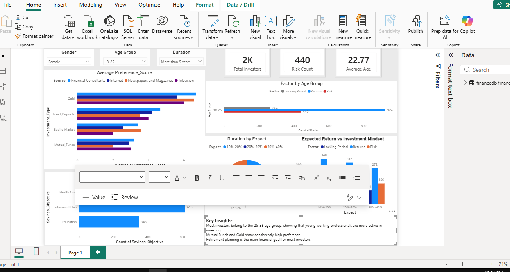

Project Title:

Finance Investment Behaviour Analysis

Tools Used:

MySQL

Power BI

Data Visualization

Project Overview:

This project analyzes investment behavior based on demographic and financial factors such as gender, age, risk preference, investment duration, and expected returns.

Key Analysis Performed:

Gender distribution

Risk vs Return mindset

Average investment preference score

Duration vs Expected Return

Most preferred investment avenue

Key Insights:

Most investors belong to the 26–35 age group, showing that young working professionals are more active in investing.

Mutual Funds and Gold show consistently high preference..

Retirement planning is the main financial goal for most investors.

Short-term investors expect moderate returns.

Dashboard Preview:

[]

## Dashboard Demo Video

[Click here to watch the demo](fianance_.mp4)
